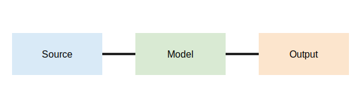

# Introduction

The workflow has three parts (@fig-workflow).[^note]

{#fig-workflow fig-alt="Source flows to semantic model and then output."}

[^note]: This footnote verifies note preservation.

# Structured content

1. First stage
   - Authored content
   - Typed metadata
2. Second stage
   1. DOCX output
   2. PDF output

| Object | Identifier | Editable |
|---|---|---|
| Abstract | region:abstract | Yes |
| Version | metadata:version | Yes |

The model includes the expression

$$
R(t) = 1 - exp(-H(t)).
$$

::: section-landscape
:::

## Landscape content

| Property | DOCX | PDF | JATS | Expected |
|---|---|---|---|---|
| Heading | Native | Native | Native | Preserved |
| Margin | Section | Page | Omitted | Reported |

::: section-default
:::

# References

The approach follows a synthetic reference [@fixture2024].

::: {#refs}
:::
